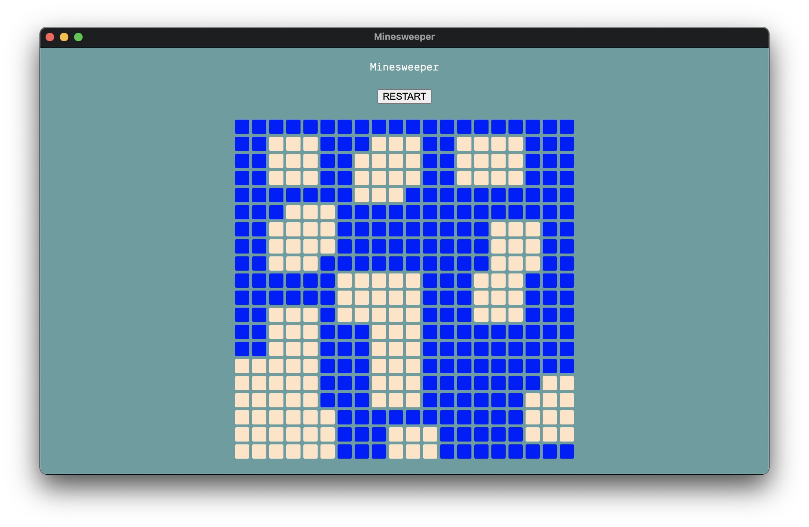

# minesweeper

Building a Minesweeper Game from scratch

#### CURRENT STATUS:



### TODO:

#### Development

- [ ] Support Typescript
- [ ] Module system(such as DI, css module, etc..)
- [ ] Render using Framework(such as React) instead of vanilla js
- [ ] Separate game logic into its own module(GameService.ts, StatService.ts, Map.ts, Cell.ts, Container.ts)

#### Feature

- [ ] Game stat(Time, Score)
- [ ] Multiple Theme
- [ ] Audio
- [ ] Feature toggle(You can toggle a feature on and off, such as Clock and Audio, they are annoying sometimes)

#### Optimize

- [ ] Game logic

### How to play

1. Clone this repo

```bash
git clone https://github.com/kunish/minesweeper.git
```

2. Install dependencies

```bash
yarn
```

or

```bash
npm i
```

3. Start a local service

```bash
yarn start
```

or

```bash
npm run start
```

4. Game time!!!

### Contributing

PRs are welcome 🤲
